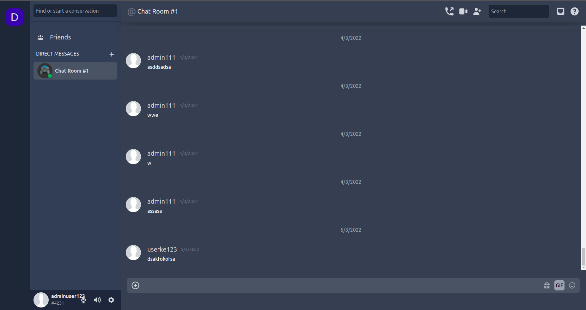
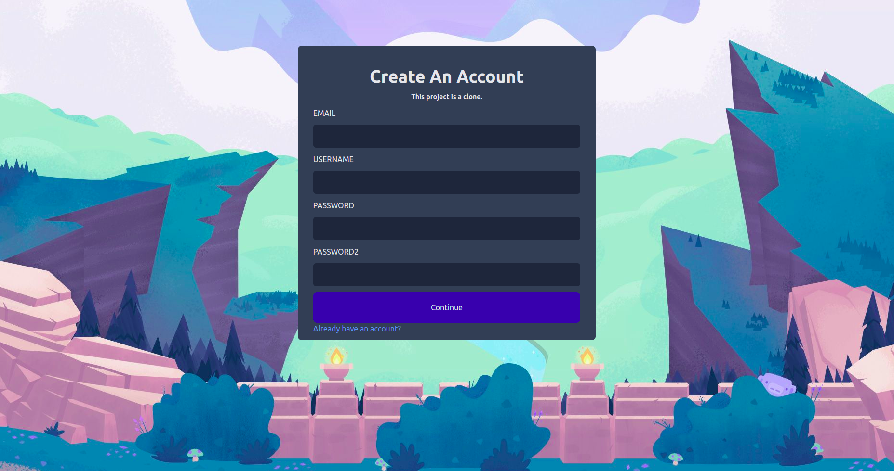
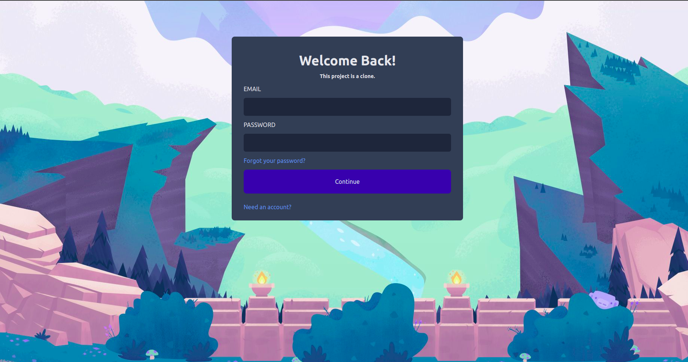

# Discord Clone

A Discord clone which created with ReactJS & NodeJS.

username:kullanici123@hotmail.com password:kullanici123

## Topics

- Redux Toolkit
- Redux Thunk
- React Hooks
- Flexbox
- Node.js
- MongoDB

In the project directory, you can run:

### `npm start` or `yarn start`

Runs the app in the development mode.\
Open [http://localhost:3000](http://localhost:3000) to view it in the browser.

The page will reload if you make edits.\
You will also see any lint errors in the console.

